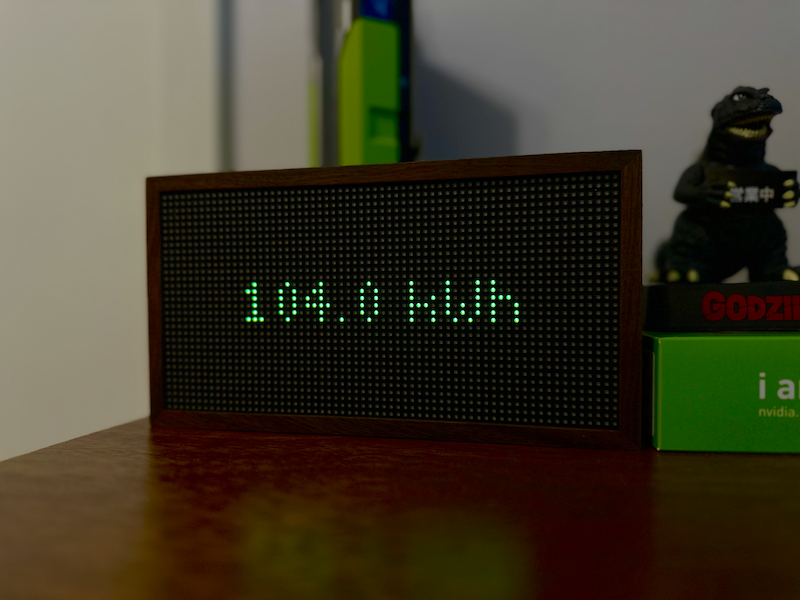

# Personal Tidbyt Apps

## Design Pattern

Docker development, deployment and pushing. Currently using only local API resources.

## Current Apps

- prometheus-monitoring: Starlark http call to a local Prometheus server to capture and report aggregate GPU Power consumption.
  
